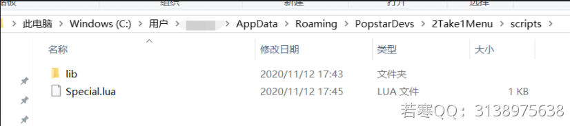

# 2Take1付费Lua使用教程

**如果你想添加其他的脚本，请看下载教程**

## **1.售后群下载脚本文件**

**如下图操作：**

 (1) (1) (1) (1).png>)

**1.按Windows+R输入%appdata%进入如图路径**

**Windows在你空格旁边不知道就自己百度Windows键运行**

 (1) (1) (2) (1).png>)

**⒉将你想添加的Lua脚本文件放入下图路径，然后在游戏中加载脚本即可**

**放入图内文件夹Roaming\PopstarDevs\2Take1Menulscripts**

## **2.游戏内操作：**

 (1) (1).png>)

**选择脚本之后点击加载**

**左下角出现弹窗成功**

**打开脚本功能**

 (1) (1) (1) (1) (1).png>)

**点进去后选择脚本启动**
