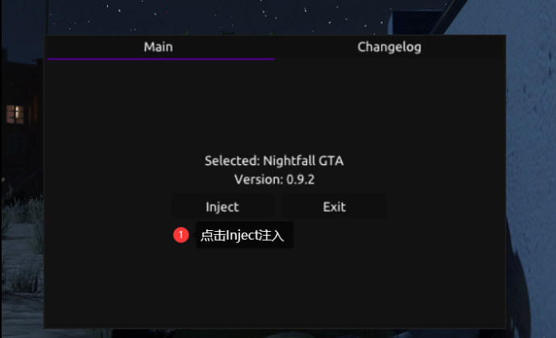

# 黄昏使用教程

## <mark style="color:red;">1.注册：</mark>

**进入官网：**[**https://nightfall.menu/login**](https://nightfall.menu/login)\*\*\*\*

**如下图操作：**

 (1) (1).png>)

> **【如果注册时下图中的验证码无法显】**
>
> 
>
> **【点此查看解决方法】**


**注册自己的账号密码，不要带符号和中文！**


 (1) (1) (1).png>)

**注册好了输入自己注册的账号密码点登录**

 (1) (1) (1) (1) (1).png>)

**登录后如图操作：**

 (1) (1) (1) (1) (1) (1).png>)

 (1) (1) (1) (1).png>)

## <mark style="color:red;">**2.下载：**</mark>

 (1) (1) (1) (1) (1).png>)

**官网下载最新注入器：**

 (1) (1) (1) (1) (1).png>)

**然后进入游戏故事模式**

**如下图操作：**

 (1) (1) (1) (1) (1) (1).png>)

 (1) (1) (1) (1) (1).png>)

**点击登录后，会提示下图安装完成**

 (1) (1) (1) (1).png>)


**安装只需要一遍，除非你卸载了或者更换了电脑，否则下次只需要打开游戏注入菜单**

**然后进入故事模式点击注入黄昏**


 (1) (1) (1) (1) (1).png>)

**如上图所示代表注入成功，上面控制台不能关闭，请最小化**

## <mark style="color:red;">**3.使用：**</mark>

**`F4` 呼出/隐藏菜单**

**方向键`↑`  `↓` 控制上下**

**方向键`←`  `→` 控制左右**

**`回车键/Ent` 确定； `退格键/Back` 返回**
