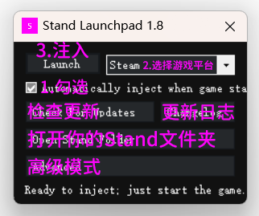

# Stand使用教程

## 1.注册：

**进入Stand官网：**[**https://stand.gg/account/register**](https://stand.gg/account/register)


<mark style="color:red;">**不要使用网页翻译**</mark>

<mark style="color:red;">**请严格按照以下教程操作,在不看教程的前提下误操作所导致的不可逆转的错误,皆由使用者自己承担!**</mark>



**关于账户ID的说明：**

**禁止分享账户ID，官方有自动检测基址，若违规账户ID会被封禁**

<mark style="color:red;">**账户ID：登陆官网用的，无法用于注入Stand，自己保存好，丢失无法找回(用你所有能记住的方法来记住,比如手机备忘录/微信收藏/QQ收藏等等)**</mark>

<mark style="color:red;">**激活码：用来注入Stand，无法用于登陆官网**</mark>



<mark style="color:red;">**注：禁止将升级 Key 用于兑换 Stand 余额；**</mark>

<mark style="color:red;">**谨记注册后生成的账户登录 ID；**</mark>

<mark style="color:red;">**Stand注意事项：**</mark>

<mark style="color:red;">**严禁使用Stand发广告语、高频发公屏消息**</mark>

<mark style="color:red;">**Stand 网页账户共享**</mark>

<mark style="color:red;">**随意使用全局崩溃/恶搞(当你使用了全局崩溃崩溃了Stand的用户,他可以去举报你，至于怎么处置得看作者,可能会封禁你的账户又或者不受理;同理你也可以在被Stand用户崩溃后去举报)**</mark>

<mark style="color:red;">**上方所有操作皆由用户自行承担后果,有异议请自行联系Stand管理上述.**</mark>


## **2.下载：**

**官方下载注入器：**

****.png>)****

## **3.安装注入：**

**进入**<mark style="color:purple;">**游戏故事**</mark>

<mark style="color:purple;">**鼠标右键管理员运行**</mark>**注入器**

**如图操作：**

.png>)

.png>)

**做完新手教程即可正常使用**

## **4.使用：**

### **操作方式：**


<mark style="color:blue;">**Stand有2种控制方式，分别对应 有 无 小键盘用户**</mark>




**小键盘 `+`  呼出/隐藏菜单**

**小键盘`8`  `2` 控制上下**

**小键盘`4`  `6` 控制左右**

**小键盘`5` 确定； `0` 返回**

**小键盘`7` 上翻列表；`3` 下翻列表**



**`F4` 呼出/隐藏菜单**

**方向键`↑`  `↓` 控制上下**

**方向键`←`  `→` 控制左右**

**`回车/Ent` 确定； `退格键/Back` 返回**

**键盘右边的`Ctrl` 上翻列表；`Shift` 下翻列表**




<mark style="color:red;">**注意：如果你进入故事模式后是下图中的情况，说明你网络问题未连接到服务器**</mark>

****.png>)****

**解决办法：**

<mark style="color:blue;">**禁止使用免费加速器 以及 雷神/薄荷**</mark>** 加速器**

> **UU加速`模式3`**
>
> **迅游加速器`模式3/5`**
>
> **奇游加速器`模式1/4`**

**还不行请点此查看解决办法**

