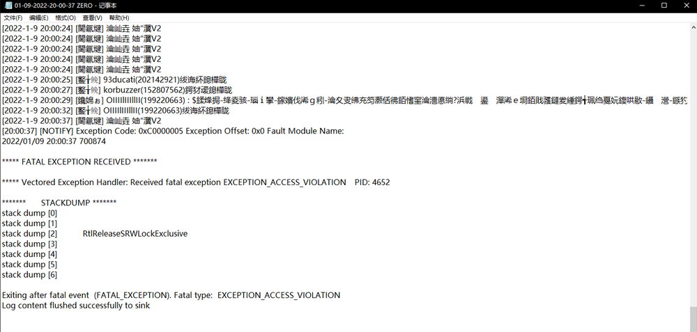

# ZERO使用教程

## <mark style="color:red;">1.注册：</mark>

**售后群下载注入器**

 (1) (1) (1) (1) (1) (1).png>)

**下载后 **<mark style="color:blue;">**鼠标右键管理员运行**</mark>

> **如若打开时提示下图👇**
>
> **** (1) (1) (1) (1) (1) (1) (1).png>)****
>
> **【点此查看解决办法】**

**然后按照下图操作：**

 (1) (1) (1) (1) (1).png>)


<mark style="color:red;">**注册账号密码不要带标点符号跟中文 请选择纯英文或数字，建议字数不超过11位**</mark>** **&#x20;

<mark style="color:red;">**如若注册时无反应或者提示激活码无效，请把C盘里的ZERO文件夹删掉，再重新注册激活**</mark>


**输入完信息后 **<mark style="color:red;">****</mark>** **<mark style="color:blue;">**点击注册**</mark>

## <mark style="color:red;">**2.注入：**</mark>

<mark style="color:blue;">**进入游戏故事模式**</mark>**按照下图操作点击注入**

 (1).png>)

 (1) (1).png>)


**接着会弹出一个黑框，不要关闭他，最小化即可**


 (1) (1) (1) (1).png>)

## <mark style="color:red;">**3.使用：**</mark>

**出现上图**<mark style="color:red;">**黑框**</mark>**代表注入成功**

**点击 `INS` 呼出/隐藏菜单**

&#x20;<mark style="color:red;">****</mark>** `鼠标点击` 操控菜单**

### **INS键位看下图：**

 (1) (1) (1) (1) (1) (1) (1).png>)

### **使用中自崩：**


**这种是因为网络波动 导致程序验证异常而自毁导致的**

**请保证网络质量稳定 即可**

**使用**<mark style="color:blue;">**腾讯加速器**</mark>**    **<mark style="color:blue;">**迅游加速器**</mark>**  **<mark style="color:blue;">**UU加速器**</mark>**比较适合ZERO**

