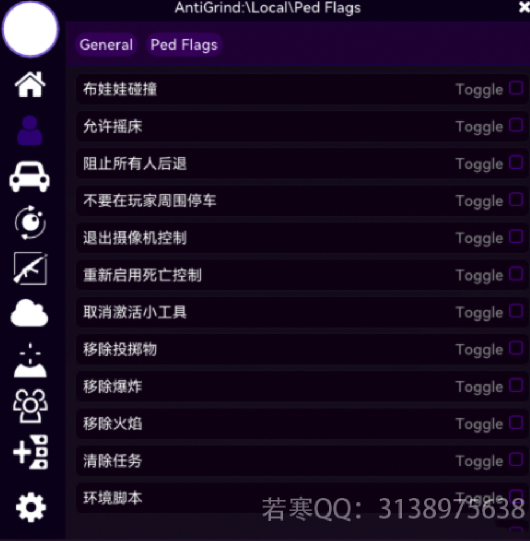

# 🍇 Delusion丨妄想

## <mark style="color:red;">1.菜单列表：</mark>

## <mark style="color:red;">2.功能图：</mark>

## <mark style="color:red;">3.特色：</mark>


* <mark style="color:blue;">**内置Lua编辑器，强大而简单；可通过Lua实现很多意想不到的功能**</mark>
* <mark style="color:blue;">**未来可以通过 Lua 实现键盘界面，**</mark>
* **强大的崩溃以及其他种种**
* <mark style="color:blue;">**可通过网页编辑小岛功能，以及云载功能，开发潜力巨大**</mark>
* **IMGUI写法；鼠标控制**
* **稳定任务**


## <mark style="color:red;">4.价格：</mark>

**145￥【**[**点此购买**](https://ruohanfkw.shop/?code=ZnJvbT0xMDA2JmE9MiZiPTEwMw%3D%3D)**】**

## <mark style="color:red;">5.定位：</mark>

**Lua/任务/养老**
