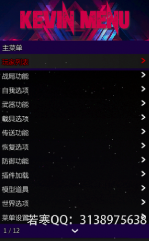
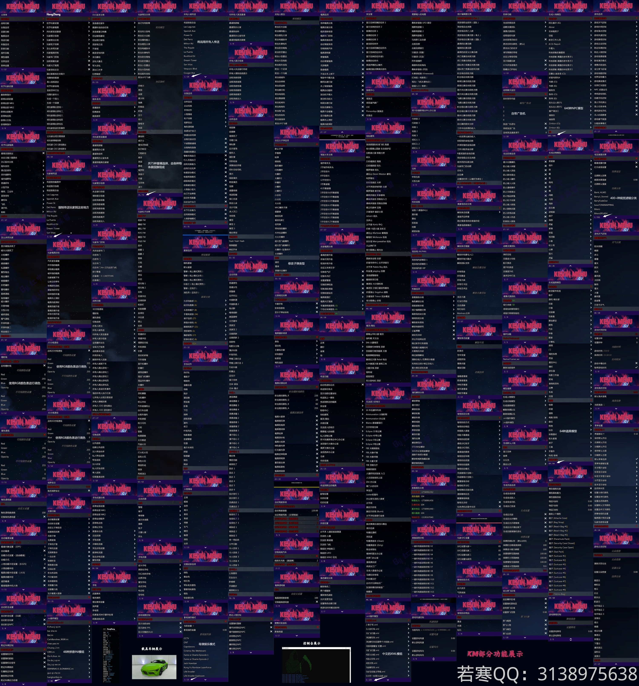

# ♏ KM丨骑士

## <mark style="color:red;">1.菜单列表：</mark>

## <mark style="color:red;">2.功能图：</mark>

## <mark style="color:red;">3.普通版与高级版的区别：</mark>


* **高级版比普通版的功能高出数百种(功能图展示的是高级版的功能)**
* **高级版支持Win7/Win10/Win11；普通版不支持Win7**
* **高级版可以更换主题；普通版只能改变题头文字**
* **高级版同时支持小键盘/方向键操控；普通版只能通过配置文件二选一高级**
* **高级版可以修改任务分红**
* **高级版支持ASI插件**
* **高级版有广告机监控与自动发送广告功能**


## <mark style="color:red;">4.特色：</mark>


* **刷钱一次250w（相对稳定）**
* **ASI.插件\[支持辅助功能拓展 插件为ASI格式]**
* **刷等级，人物解锁，物品解锁等**
* **可以跳前置（小岛/DC）**
* **种类繁多，分类清晰**
* **支持Win7/Win10/Win11系统！**


## <mark style="color:red;">5.价格</mark>

* **KM丨骑士普通版：               50￥**
* **KM丨骑士高级版：               100￥【**[**点此购买**](https://ruohanfkw.shop/?code=ZnJvbT0xMDA2JmE9MiZiPTk2)**】**

## <mark style="color:red;">6.定位：</mark>

**任务/娱乐/养老/刷 💴**
