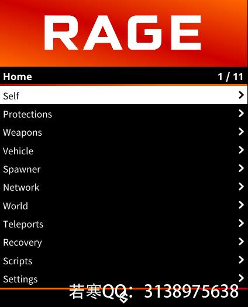
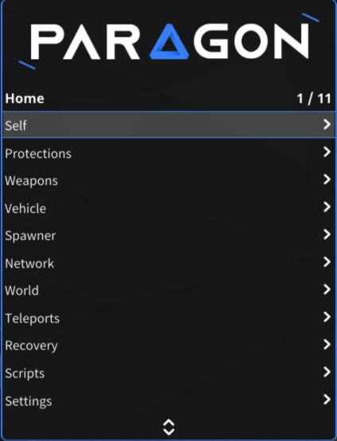
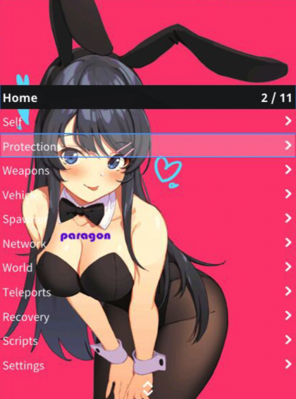
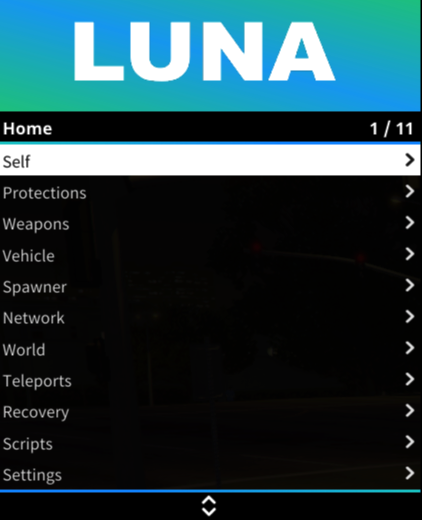
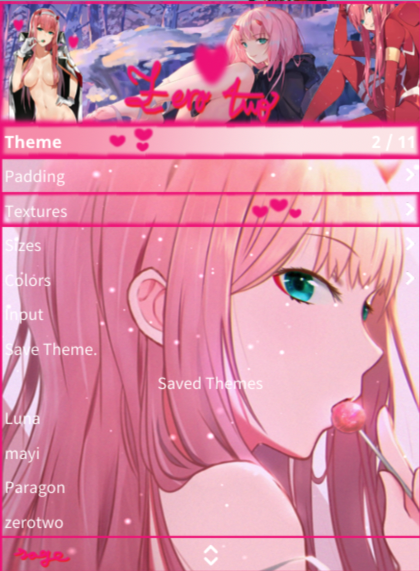

# ® RAGE

## <mark style="color:red;">1.菜单列表：</mark>

## <mark style="color:red;">2.功能图：</mark>

## <mark style="color:red;">3.特色：</mark>


* <mark style="color:blue;">**★★★★★综合评级**</mark>
* <mark style="color:blue;">**★★★性价比优势**</mark>
* <mark style="color:blue;">**★✰✰防护强度\[一线防护水平] \[可快捷键开启任意甚至所有实体拦截]**</mark>
* <mark style="color:blue;">**★✰✰崩溃强度\[3种崩溃与3种踢出功能]**</mark>
* <mark style="color:blue;">**★★★抢主机\[获得战局主机可以踢出战局内任意玩家]**</mark>
* <mark style="color:blue;">**★✰✰Lua插件\[支持辅助功能拓展 插件为Lua格式]**</mark>
* <mark style="color:blue;">**★★✰追战局支持**</mark>
* <mark style="color:blue;">**★★★自定义全局快捷键\[设置功能快捷键 一键开启辅助功能开关]**</mark>
* <mark style="color:blue;">**★★★多开兼容性\[指的与其他辅助菜单多开或者双开的兼容性]**</mark>
* **非套壳菜单全自主开发**&#x20;
* **拥有任务助手；可跳前置与改分红：末日/赌场/小岛前置**&#x20;
* **主题功能极其丰富**
* **可高度修改载具的后台数据,如:动力/扭矩/加速度/手刹强度/升档/降档**
* **自定义设置配置文件**
* **聊天命令**
* **主机工具箱**&#x20;
* **基础功能非常全面**&#x20;


## <mark style="color:red;">4.价格：</mark>

&#x20;**RAGE    80￥【**[**点此购买**](https://ruohanfkw.shop)**】**

## <mark style="color:red;">5.定位：</mark>

**任务/养老**

## <mark style="color:red;">6.主题赏析：</mark>

> 更多主题请到售后群查看！

