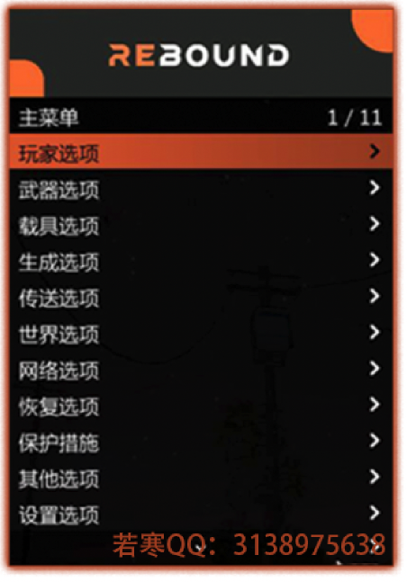

# 🥓 Rebound丨回弹

## <mark style="color:red;">1.功能列表：</mark>

## <mark style="color:red;">2.功能图：</mark>

## <mark style="color:red;">3.特色：</mark>


* **功能齐全，数量众多**
* **自带任务跳前置功能，拥有踢人/崩溃选项**
* **拥有基本的脚本/网络/崩溃防护功能**
* **启动器等文件云端更新，较方便的注册激活与注入**
* **强力开发团队，更新速度快（知名菜单开发者参与，会不断完善，增值型菜单）**
* **Lua.插件\[支持辅助功能拓展 插件为Lua格式]**
* **A.S.I插件\[支持辅助功能拓展 插件为A.S.I格式]**
* **全快捷键支持**
* **支持系统：Win7/Win10/Win11**


## <mark style="color:red;">3.价格：</mark>

**回弹VIP版               185￥【**[**点此购买**](https://ruohanfkw.shop/?code=ZnJvbT0xMDA2JmE9MiZiPTg4)**】**

## <mark style="color:red;">4.定位：</mark>

**任务/娱乐/恶搞/养老**

## <mark style="color:red;">5.缺点：</mark>

**辅助有一定几率会自我崩溃自我闪退（这个跟自身环境有关：网络，电脑配置等等）**
