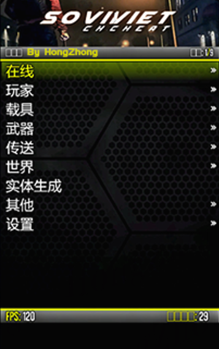

# ✴ Soviet

## <mark style="color:red;">1.菜单列表：</mark>

[**2.点击查看视频赏析**](https://streamja.com/49aA6)

## <mark style="color:red;">**2.功能图：**</mark>

 (1).png>)

## <mark style="color:red;">**3.特色：**</mark>


* <mark style="color:blue;">**★★✰✰✰综合评级**</mark>
* <mark style="color:blue;">**★✰✰性价比优势**</mark>
* <mark style="color:blue;">**★✰✰防护强度\[拥有20+的防护拦截功能]**</mark>
* <mark style="color:blue;">**★✰✰崩溃强度\[拥有V1\~V5五种崩溃]**</mark>
* <mark style="color:blue;">**★✰✰追战局支持**</mark>
* **灭霸模组MOD;内含众多有趣功能：\[车速表]\[丧尸]\[雷霆之剑]\[飞行滑板]\[大铁锤]\[墙上行走]等等**
* **兼容任务，做差事任务无BUG。**
* **云端配置:可在官网修改菜单配置**


## <mark style="color:red;">**4.价格：**</mark>

**Soviet             **<mark style="color:red;">****</mark>**             400￥【点此购买】**

## <mark style="color:red;">**5.定位：**</mark>

**娱乐/Mod/养老**


**多说一句：Soviet的名字跟 \[苏联/苏维埃/俄罗斯] 无关；**

**是根据 GTAⅣ 的主题曲：Soviet Connection 而命名的**

