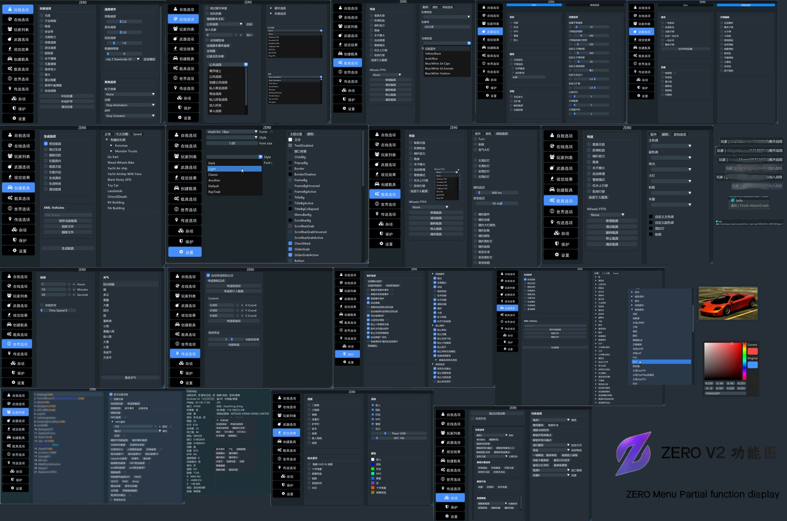
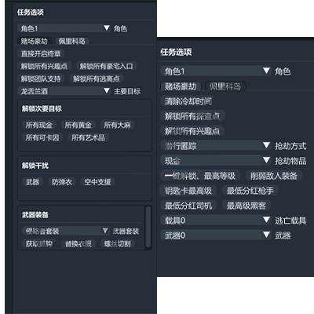

# 💤 ZERO丨Menu

## <mark style="color:red;">1.菜单列表：</mark>

.png>)

## <mark style="color:red;">2.功能图：</mark>

## <mark style="color:red;">3.特色：</mark>


* <mark style="color:blue;">**★★★★✰综合评级**</mark>
* <mark style="color:blue;">**★★★性价比优势**</mark>
* <mark style="color:blue;">**★★★防护强度\[一线防护水平]\[可防御大部分菜单的崩溃！]**</mark>
* <mark style="color:blue;">**★★★崩溃强度\[一线的崩溃功能]\[优秀的崩溃功能 可崩溃大部分菜单！]**</mark>
* <mark style="color:blue;">**★✰✰同步踢出\[踢出不是主机的任何一位玩家]**</mark>
* **鼠标操作，功能简介界面舒服 反应迅速**
* **超级强力崩溃 拥有23种崩溃！**
* **真PVP.防护.性能辅助！**
* **稳定任务（如有进不了任务的问题，请及时反馈）**
* **多开兼容性好，ZERO可以跟2Take1 午夜 0X 等菜单双开或多开**
* **最人性化的透视功能\[IMGUI写法]**
* **最人性化的透视\[美观] \[自定义颜色 距离 骨骼 头部]**
* **拥有独家任务助手/改分红**
* ********


## <mark style="color:red;">4.价格：</mark>

**ZERO--Menu**               **150￥【**[**点此购买**](https://ruohanfkw.shop/?code=ZnJvbT0xMDA2JmE9MiZiPTc0)**】**

## <mark style="color:red;">**5.定位：**</mark>

**崩溃/防护/hvh/任务**
