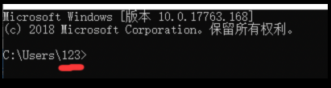
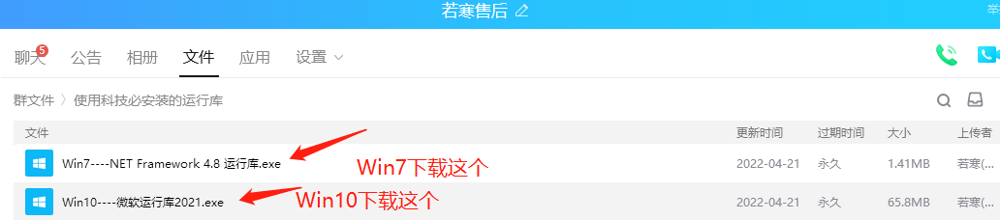
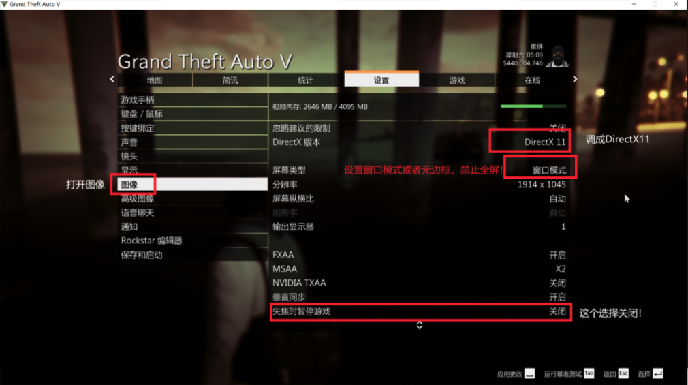
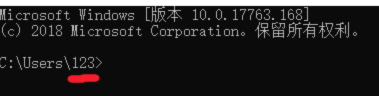

# ❓ 注入失败或游戏闪退

## <mark style="color:blue;">GTA5</mark>

### <mark style="color:red;">第一步</mark>

**WIN+R 输入CMD 回车**

**查看是否中文路径**

**如果是，尝试修改"我的文档"路径**

**WIN7系统修改教程** [**点击查看WIN7系统修改教程**](https://jingyan.baidu.com/article/eb9f7b6da448cb869364e8ed.html)

**WIN10系统修改教程** [**点击查看WIN10系统修改教程**](https://jingyan.baidu.com/article/148a1921a96ad24d71c3b1ae.html)

**WIN11系统修改教程** [**关闭Win11防火墙教程**](https://jingyan.baidu.com/article/f00622282d18b5bad3f0c89c.html)     ****     [**关闭Win11自带杀毒软件教程**](https://www.yunqishi.net/video/173193.html)****

**出现这种情况是因为 系统文档路径是中文**\
**右键-属性-位置**\
**修改到英文路径即可**


**【注意不要改成中文路径】**\
**【教程仅供参考，别按照教程傻傻的改成了中文路径 "F:\文档备份"了】**\
**【**<mark style="color:red;">**改成英文，英文，英文，你哪怕是拼音也行啊，就算"F:\wendangbeifen"或者"D:\123123"也行**</mark>**】**


**售后群下载运行库并安装【默认选项安装即可】**

### <mark style="color:red;">第二步</mark>

**游戏内设置：**

**游戏设置-图像-失焦时暂停游戏** <mark style="color:red;">**关闭**</mark>

**游戏设置--**<mark style="color:red;">**窗口化**</mark>


**电脑设置：**

**卸载电脑杀毒软件**

**【点此查看关闭WIN10自带杀毒教程】**

**使用DX修复工具修复 【点此查看DX修改教程】**

**关闭退出所有覆盖层软件！例如:GAME++,微星小飞机,NVIDIA GeForce等等**



**加速器**

**尝试更换加速器**

<mark style="color:blue;">**禁止使用免费加速器 以及 雷神/薄荷**</mark>** 加速器**

> **UU加速`模式3`**
>
> **迅游加速器`模式3/5`**
>
> **奇游加速器`模式1/4`**


**检查游戏文件夹内是否有其他菜单辅助残留，如有请删除干净**

## <mark style="color:blue;">RDR2</mark>

### <mark style="color:red;">第一步</mark>

**WIN+R 输入CMD 回车**

**查看是否中文路径**

**如果是，尝试修改"我的文档"路径**

**WIN7系统修改教程** [**点击查看WIN7系统修改教程**](https://jingyan.baidu.com/article/eb9f7b6da448cb869364e8ed.html)

**WIN10系统修改教程** [**点击查看WIN10系统修改教程**](https://jingyan.baidu.com/article/148a1921a96ad24d71c3b1ae.html)

**WIN11系统修改教程 请查找百度**

**出现这种情况是因为 系统文档路径是中文**\
**右键-属性-位置**\
**修改到英文路径即可**


**【注意不要改成中文路径】**\
**【教程仅供参考，别按照教程傻傻的改成了中文路径 "F:\文档备份"了】**\
**【**<mark style="color:red;">**改成英文，英文，英文，你哪怕是拼音也行啊，就算"F:\wendangbeifen"或者"D:\123123"也行**</mark>**】**


**售后群下载运行库并安装**

### <mark style="color:red;">第二步</mark>

**游戏内设置：**

**游戏设置-**<mark style="color:red;">**窗口化**</mark>

**DX版本调成**<mark style="color:red;">**12**</mark>


**电脑设置：**

**卸载电脑杀毒软件**

**【点击查看关闭WIN10自带杀毒教程】**

**使用DX修复工具修复 【点此查看DX修改教程】**

**关闭退出所有覆盖层软件！例如:GAME++,微星小飞机,NVIDIA GeForce等等**



**加速器**

**尝试更换加速器**

<mark style="color:blue;">**禁止使用免费加速器 以及 雷神/薄荷**</mark>** 加速器**

> **UU加速`模式3`**
>
> **迅游加速器`模式3/5`**
>
> **奇游加速器`模式1/4`**


**检查游戏文件夹内是否有其他菜单辅助残留，如有请删除干净**

## <mark style="color:red;">重装系统</mark>

**如果以上无法解决注崩，尝试重装系统**

**售后群下载"系统镜像"和"装系统镜像程序"**

**重装系统教程 【点此查看重装系统教程】**

**推荐系统：Win10 1903+ 专业版**
